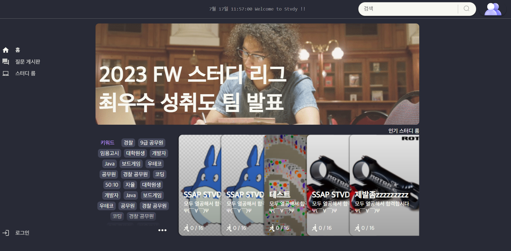

# 목차

1. [**서비스 소개**](#1)
2. [**기획 배경**](#2)
3. [**기능 소개**](#3)
4. [**기술 스택**](#5)
5. [**프로젝트 일정 및 산출물**](#6)
6. [**개발 멤버 및 회고**](#7)

<br/>

---

<br/>

<div id="1"></div>

# 서비스 소개

## 서비스 설명

### 개요

- 한줄 소개 : 혼자말고 함께 **공부**하자
- 서비스 명 : **`STVDY(스터디)`**

### 타겟 🎯

- 혼자서 공부를 하면 집중력이 저하되는 사람들

- 남들과 같이 공부를 하면서 의욕을 내고 싶은 사람들

- 집중력을 높이는 나만의 테마를 사용하고 싶은 사람들
  
  > 👉 \*\* **혼자서 공부를 하기보다 여럿이서 공부하고 싶은 모든 사람들** \*\*

<div id="2"></div>

# 기획 배경

## 배경

자기 계발의 시대. 언제 어디서든 나를 성장시키는 세상입니다. 많은 사람들이 공부를 하겠다 다짐하지만, 혼자서 하는 공부는 집중력이 저하되거나, 미루게 되곤 합니다.  `STVDY`은 이러한 집중력 저하와, 공부를 미루는 것에 대해 상호 경쟁과 타인의 의식을 통해서 집중력을 향상 시킬수 있습니다.
<br/>
<br/>
STVDY의 장점은 다음과 같습니다. 먼저. 자신만의 프로필을 통해 나를 은유적으로 드러낼 수 있으며, 나만의 집중력 테마를 이용해, 더욱 공부 및 회의에 집중할 수 있게 합니다.  또한 화상 스터디 또는 회의시 나의 내용을 공유하기 위한 화면 공유기능이 탑재되어 있으며, 이와 함께 기기 선택 변경도 가능합니다. 그리고 나를 드러내기 싫어하는 사람을 위한 캠 오프, 마이크 오프와 부담없이 서비스에 접근가능해, 사용자가 부담없이 사용가능하겠습니다.

## 목적 🥅

**스터디, 집중할 수 있는 분위기에서 하자**

## 의의

- 비대면 상황에서 어디서든지 다른 사람들과 함께스터디를 할 수 있는 온라인 비대면 스터디    
- 질문게시판으로 궁금증을 공유하고 서로 해결하며 공부 효과 상
- 프로필과 나만의 테마를 이용해 집중력 상승

<div id="3"></div>

# 기능 소개

### 메인

#### 1. 비로그인시



 

#### 2. 로그인시

### 회원가입 및 로그인


### 질문게시판

#### 1. 최신질문순 질문 목록


#### 2. 해결중인 질문 목록


#### 3. 답변 없는 질문 목록


#### 4. 질문 세부


#### 5. 질문 작성


### 프로필

### 테마 변경

### 스터디룸

### 챗 GPT

<div id="5"></div>

# 기술 스택

## 1. webRTC

### webRTC란?

<aside>
WebRTC (Web Real-Time Communication)는 웹 브라우저 간에 플러그인의 도움 없이 서로 통신할 수 있도록 설계된 API 입니다.
음성 통화, 영상 통화, P2P 파일 공유 등으로 활용될 수 있습니다.


</aside>

### openvidu

WebRTC를 보다 간단하게 적용할 수 있고, 다양한 프레임워크와 호환성이 높은 openvidu를 사용하여 프로젝트를 진행했습니다.

### 적용

`STVDY` 에서는 화상회의 및 스터디를 하기 위해 openVidu를 사용합니다.

## 2. Web Socket

### web Socket이란?


<aside>
웹 소켓은 사용자의 브라우저와 서버 사이의 인터액티브 통신 세션을 설정할 수 있게 하는 기술입니다. 
개발자는 웹 소켓 API를 통해 서버로 메시지를 보내고 서버의 응답을 위해 서버를 폴링하지 않고도 이벤트 중심 응답을 받는 것이 가능합니다.
</aside>

### 적용

`STVDY` 에서는 실시간 공유를 위해 다음 부분에서 webSocket을 사용합니다.

1. 채팅 (스터디룸 내 채팅)
2. 방 목록화면
   -> 방의 상태(참여 유저 수)를 실시간으로 공유합니다.

## 3. 개발 환경


## 4. CI/CD 배포 환경


<div id="6"></div>

# 프로젝트 일정 및 산출물

## 프로젝트 일정

```
프로젝트 기획 및 설계 : 23.07.04 ~ 23.07.21
개발 : 23.07.24 ~ 23.08.11
배포 : 23.08.07 ~ 23.08.11
테스트 : 23.08.14 ~ 23.08.17
시연 및 발표 : 23.08.18
```

## 프로젝트 진행

### 1. Git flow

---

Git flow 사용을 위해 `sourcetree` 프로그램을 사용하였고 우아한 형제들의 [git flow](https://techblog.woowahan.com/2553/)을 참고했습니다. front 와 back 으로 나누어 `faature`의 하위 브랜치를 사용하였으며 매일 오전 스크럼 이후 `back` 브랜치와 `front` 브랜치로 merge 하여 사용했습니다.<br>
`commit message`는 `feat(대기방): 채팅방 구현` 과 같이 통일하여 작성했습니다.<br>
<br><br><br>

### 2. Jira

---

매주 월요일 오전 회의에서 금주의 진행 이슈를 백로그에 등록했습니다. 전주에 완료하지 못한 이슈나, 앞으로 진행할 이슈들을 추가합니다.

- 에픽은 회원, 미팅, 설계 등으로 구성했습니다.
- 레이블은 BE, FE, full 으로 구성했습니다.
- 스토리는 명확한 전달을 위하여 `API 명세서 작성`와 같이 작성했습니다.
- 작업현황을 실시간으로 지라에 반영하여 현재 팀원이 어떤 작업을 하고있는지, 일정에 딜레이가 있는지 한 눈에 알아볼 수 있게 했습니다.<br>
  

## 프로젝트 산출물

### 1. Figma

[](https://www.figma.com/file/fRBQDGRSSAqfpwLACFunn3/Material-You-for-web-apps.-Desktop-%26-mobile-templates-(Community)?node-id=9003%3A179932)
<br>

### 2. ERD

[](https://www.erdcloud.com/d/tj8QmWP6ENjYwhnWX)
<br>

### 3. API 문서

[](https://fate-filament-e27.notion.site/1e6cdca64f51476c9f2656b93c3adc2a?v=18ca13453dd8437fb6e065fc83645fab)

<div id="7"></div>

# 개발 멤버 및 회고

- 안세혁 : 

- 이대근 : 

- 김소이 : 

- 윤우혁 : 

- 김범기 : 처음으로 다수와 함께 하는 프로젝트를 진행하게 되면서 소통의 중요성과 기획단계가 얼마나 중요한지에 대해서 몸소 체감했습니다. webRTC 기술의 front부분을 맡으면서, 해당 기술에 대해 지식이 전무해 학습하면서 프로젝트에 도입하는 것이 프로젝트 기간 동안 크나큰 고통이었지만, 이 고통이 성장에 도움이 되었습니다.

- 안대현 : 
